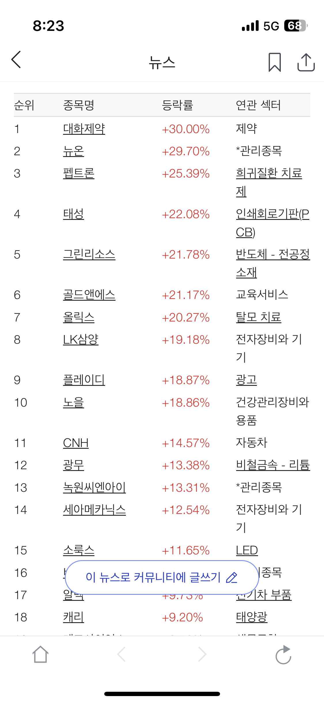

# 펩트론

펩트론

주요** 내용**

이사회결의일(결정일) 또는 사실확인일 : 2024.10.07 (1) 계약 상대방: 미국 일라이 릴리 (Eli Lilly and Company, 이하 릴리)  (2) 계약기간: 2024. 10. 07 ~ 평가 종료 시까지(약 14개월)  (3) 계약체결일: 2024. 10. 07  (4) 계약의 내용: 펩트론 SmartDepot™ 플랫폼 기술을 릴리가 보유한 펩타이드 약물들에 적용하는 공동연구를 위해 펩트론은 일라이 릴리에게 비독점 라이선스를 부여하며, 이는 전세계 대상으로 서브라이선스 권리가 포함된 완전 지불된 로열티가 없는 제한된 라이선스이고 내부 연구개발 목적 및 펩트론 과의 후속 상업 라이선스 계약을 위한 목적으로 한정됨  (5) 계약금액: 비공개

**태성 주가 쑥쑥... 배터리 성능 좌우 핵심 장비 RTR 도금 장비 주목**
2024-10-08     최소연 기자

태성이 중국 CATL향 'RTR 도금 장비' 매출 가시화로 실적개선 기대감이 주가를 끌어 올리고 있는 것으로 풀이된다.
태성의 핵심 기술력을 인정받고, 미래 성장 동력을 확보했다는 점에서 의미가 크다.
RTR(Reverse Through Rolling) 도금 장비는 배터리의 성능을 좌우하는 핵심 장비로, 특히 고성능 전기차 배터리 생산에 필수적이다.
중국 CATL은 세계적인 배터리 제조 기업으로, 태성의 RTR 도금 장비를 채택함으로써 배터리 생산 경쟁력을 한층 강화할 수 있게 됐다.
독자적인 RTR 도금 기술을 바탕으로 고객 맞춤형 솔루션을 제공하며 시장에서 차별화된 경쟁력을 확보하고 있다. 이번 CATL향 장비 공급은 태성의 기술력을 입증하고, 향후 배터리 시장에서의 입지를 더욱 공고히 하는 계기가 될 것으로 기대된다.
태성이 속한 2019 상반기 신규상장 관련주(네이버 증권)인 엠에프엠코리아 아모그린텍  천보 프로이천 이어케어텍 _TS트릴리온_  코퍼스코리아 웹케시 에코프로비엠  셀리드 태성 드림텍  아모그린텍 수젠텍 코퍼스코리아 마이크로디지탈 까스텔바작 컴퍼니케이 압타바이오 현대무벡스 현대오토에버 지노믹트리 셀리드가 있다.
태성은 PCB(인쇄회로기판) 자동화 기계, 특히 습식 설비를 전문적으로 생산하며 국내외 시장에서 기술력을 인정받고 있다.
PCB 제조 과정에서 필수적인 습식 설비는 식각, 표면 처리 등 다양한 공정에 사용된다. 태성은 이러한 핵심 설비를 자체 개발하여 생산하며, 고객 맞춤형 자동화 솔루션을 제공하고 있다.
PCB 자동화 사업뿐만 아니라, 미래 성장 동력 확보를 위해 카메라 모듈 사업부와 2차전지 사업부를 신설하고 적극적인 투자를 진행하고 있다.

올릭스는 RNA 간섭(RNAi) 기술을 기반으로 비만 치료제를 개발하고 있다.
올릭스 외에도 국내 여러 제약바이오 기업들이 비만 치료제 개발에 박차를 가하며 경쟁이 더욱 치열해질 것으로 예상된다.
위고비의 성공적인 시장 진입은 국내 제약바이오 기업들에게 비만 치료제 시장의 성장 가능성을 보여주고 있다.

09시 일본지사 개설

LK삼양은 국내 유일의 디지털카메라용 교환렌즈 제조사다. DSLR과 미러리스 카메라용 렌즈 시장에서 확고한 지위를 유지하고 있다. 최근에는 신사업으로 열화상 솔루션, 머신비전, 우주항공(드론, 인공위성) 등을 통해 신성장 동력을 확보하고 있다.
이번 일본지사 개설을 통해 핵심 개발 기술 인력 확보와 함께 일본 카메라 영상 기기 공업회(CIPA) 회원으로써 협회 및 관련 업체와 정보 교류를 활성화할 계획이다. 또한 일본 내 우수 부품 회사를 통해 정밀 부품 채용도 추진해 자사 교환렌즈의 상품성을 더욱 제고할 수 있을 것으로 기대하고 있다.
아울러, 신사업으로 추진 중인 열화상 솔루션과 머신비전 렌즈의 일본 내 거래선 및 주요 고객 확보 가능성 및 시장 진입도 검토할 예정이다.

